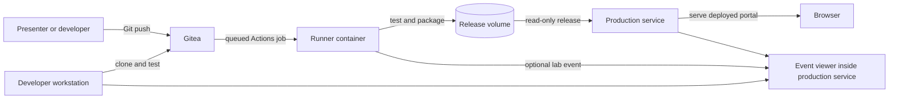

# Lab architecture

## Normal deployment flow

The runner label is `nightjar:host`. In this lab, **host mode means the job runs directly inside the runner container**. It does not mean the Ubuntu VM, and the runner has no Docker socket mount.

## Components

| Component | Purpose | Important boundary |
|---|---|---|
| Gitea | Git server, repository settings, fake secrets, and Actions history | Only port 3000 is published, on VM loopback by default. |
| Runner | Checks out, tests, and packages repository code | Runs repository-controlled commands inside its own container and writes only to its data and release volumes. |
| Production service | Watches for a release, verifies its hash, starts the portal, and displays lab events | Reads release artifacts but cannot modify them; the deployed app and collector share this container. |
| Developer workstation | Isolated checkout for the developer-targeting scenario | Persistent home directory is contained in a named volume, not the Ubuntu host home. |

## Release and deployment mechanism

1. A push to `main` queues `.gitea/workflows/build.yml`.
2. The runner clones the exact triggering commit and runs compilation and tests.
3. The workflow creates `release.tar.gz`, `release.sha256`, and release metadata.
4. It moves the completed release into the shared volume and atomically updates the `current` marker.
5. The production supervisor reads that marker, verifies SHA-256, extracts into its temporary runtime directory, and restarts the portal.
6. The portal displays the commit, run ID, artifact fingerprint, and deployment time.

This models automated deployment without granting the runner control of Docker or the Ubuntu host.

## Network and ports

Compose creates one bridge network named `lotp_lab`. Container-to-container traffic uses service names and stays on that network.

Published ports are loopback-only unless `LAB_BIND_ADDRESS` is intentionally changed:

- `127.0.0.1:3000` — Gitea.
- `127.0.0.1:8000` — deployed portal.
- `127.0.0.1:9000` — lab event viewer.

An SSH tunnel is the expected way to view these pages from outside the VM.

## Persistent and temporary state

| Storage | Writer | Reader | Contents |
|---|---|---|---|
| `gitea-data`, `gitea-config` | Gitea | Gitea | Repositories, database, and settings. |
| `runner-data` | Runner | Runner | Registration and runner work files. |
| `releases` | Runner | Production service, read-only | Packaged and hashed releases plus the current marker. |
| `prod-data` | Production service | Production service | Deployment record and lab event log, including submitted lab-only values. |
| `developer-home` | Developer container | Developer container | Isolated checkout and fake canary. |
| `/srv/runtime` tmpfs | Production service | Production service | Currently extracted application; cleared when the container is recreated. |

## Scenario mapping

- **Pipeline secret exposure:** change workflow logic in Gitea; the job can reference the fake repository secret and send its value to the demo receiver.
- **Application contamination:** modify source directly or alter packaging so extra application behavior reaches the release volume and production service.
- **Developer targeting:** modify repository-controlled setup or application code, then deliberately run it inside the developer container.

Those actions are documented as manual steps in [WALKTHROUGH.md](../WALKTHROUGH.md). Startup and reset scripts do not execute them.
